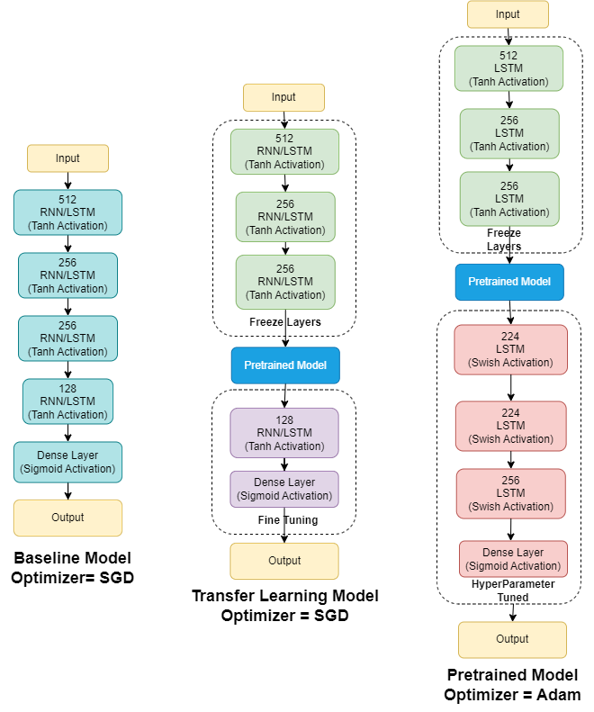
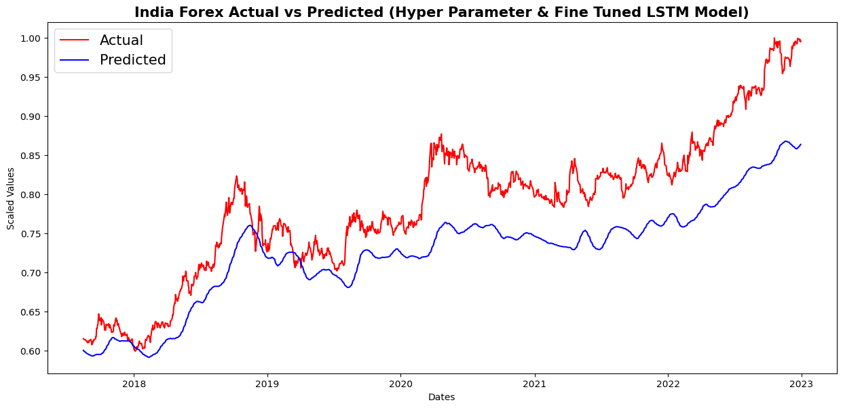

# Foreign Exchange Rate Prediction

### Abstract
This project describes in detail the methodologies and technologies used in the final project for course CS 583: Deep Learning conducted under the guidance of Professor Jia Xu and Dr. Abdul Khan. The primary objective of this project was to develop a robust deep-learning model capable of accurately predicting Foreign Exchange Rates (Indian Rupees) - a challenging task within the realm of time series analysis. A key focus of the experimentation was the evaluation of various transfer learning techniques and their impact on the overall performance of the models. The project involved creating and comparing several RNN and LSTM-based regressor models that are Fine-tuned on India’s Forex data. Performance assessments were conducted using metrics such as Mean Squared Error, Mean Absolute Error, and R-squared. Furthermore, the project investigates hyperparameter tuning to optimize the best-performing model to enhance its predictive capabilities. 

### Introduction

The Foreign Exchange Rate, or forex rate, represents the relative value of one currency compared to another and is crucial for international trade and financial transactions. Predicting forex rates poses a significant challenge due to the complex and dynamic nature of the factors influencing currency fluctuations. Multiple variables, such as geopolitical events, economic indicators, and market sentiment, contribute to the volatility of exchange rates. Additionally, the interconnectivity of global markets and the presence of intricate patterns in time series data make it challenging to capture and model accurately. 
Moreover, time series data presents its unique set of challenges stemming from temporal dependencies, non-stationarity, seasonality, trends, noise, complex patterns, limited historical information, and the dynamic influence of external factors. Addressing these intricacies calls for specialized models such as RNN and LSTM, designed to account for the sequential nature of input data.

In addition to the primary goal of constructing an accurate prediction model, this project undertakes a comparative analysis of various transfer learning techniques to identify the most effective one. The methodologies encompass the creation of a pre-trained model using 3 different types of dataset formats (Explained in detail in the method section) which incorporate data from multiple countries. Subsequently, we fine-tune the models with India's economic indicators and Forex data. The refined models are then applied to predict future Forex rates, incorporating a specified 30-day lag time to forecast the rate for the 31st day.

Ultimately, the best-performing model (LSTM), underwent a crucial refinement through hyperparameter tuning during the fine-tuning phase. In this process, the foundational layers of the pre-tuned model remained fixed, while the subsequent layers which were being fine-tuned with Indian Forex data underwent optimization. Parameters such as activation functions, node counts in each layer, and the final optimizer function were meticulously selected using the Keras-tuner library. This meticulous approach resulted in the development of a final model that significantly outperformed its counterparts created through manual trial and error. Further details on these steps will be provided in subsequent sections of this report, offering insight into the enhancement achieved through transfer learning and hyperparameter tuning.

### Methods
This section provides a comprehensive overview of the processes, technologies, and implementation details employed throughout the course of this project. The methodology encompasses the entire lifecycle of the project, detailing the steps taken to achieve the objectives set forth.
#### o Data Cleaning
 We meticulously curated the dataset to ensure its accuracy, consistency, and reliability. This involved identifying and rectifying errors, resolving inconsistencies, handling missing values, and addressing outliers.

o	Standardizing Date Format
To align disparate date formats across multiple datasets, we standardize the date values by making them universally consistent and easily distinguishable, bridging variations like ‘%d-%m-%Y’ and ‘%Y-%m-%d’ for seamless integration.

o	Interpolation of Null Values
In addressing missing data points, we employed linear interpolation techniques. This method intelligently filled null values by referencing neighboring data or predefined criteria within the dataset.

o	Dataset Merging
Combining datasets from various countries was essential. We orchestrated the merging process using Pandas' ‘merge_asof’ function, opting for a left join merge approach with a tolerance window of two days.

o	Data Normalization and Scaling
Leveraging MinMaxScaler, we standardized numerical features within a predetermined range, typically between 0 and 1. This ensured uniformity while preserving the relative distributions, enabling accurate comparisons across different variables. to form a comprehensive merged dataset.
#### o Exploratory Data Analysis
Our comprehensive EDA delved deep into dataset characteristics, distributions, and inter-variable relationships. This exploration unearthed intricate patterns, anomalies, and trends, empowering informed decisions for subsequent analyses and modeling. We specifically conducted country-wise data visualization, generating 2x2 subplots and illustrative boxplots to visualize column distributions effectively.
#### o Model Development
Employing Recurrent Neural Network (RNN) and Long Short-Term Memory (LSTM) architectures, we embarked on model development. Initially, we formulated a baseline model with RNN/LSTM layers, yielding modest outcomes. Subsequently, we engineered separate pre-trained models based on datasets with varying target data availability: no target data, partial target data, and substantial data. Utilizing transfer learning, we fine-tuned these models by freezing initial layers and augmenting them with additional RNN/LSTM layers plus a Dense layer. Hyperparameter tuning, performed using Random Search Keras Tuner, significantly enhanced the model's accuracy, refining our predictive capabilities.

### Results 

The performance evaluation of the various models implemented in our study is summarized in the table below. Mean Squared Error (MSE), Mean Absolute Error (MAE), and R-squared ($R^2$) are presented for each model, providing insights into their predictive capabilities. Notably, the HP Tuned LSTM model outperforms others, demonstrating superior predictive accuracy with a lower MSE, MAE, and a positive $R^2$ value, indicating a better fit to the data.

| Sr No.| Model |MSE|MAE|$R^2$|
| ------------- | ------------- |------------- | ------------- | ------------- |
|1|Baseline RNN |0.048|0.208|-4.73| 
|2|Baseline LSTM |0.026|0.149|-2.082| 
|3| RNN (Substantial Target Data)|0.011|0.092|-0.325|
|4| LSTM (Substantial Target Data) |0.014|0.107|-0.748|
|5| RNN (Partial Target Data) |0.013|0.105|-0.585|
|6| LSTM (Partial Target Data) |0.011|0.095|-0.420|
|7| RNN (No Target Data) |0.010|0.083|-0.196|
|8| LSTM (No Target Data) |0.010|0.089|-0.260|
|9| HP Tuned LSTM |0.004|0.059|0.446|

